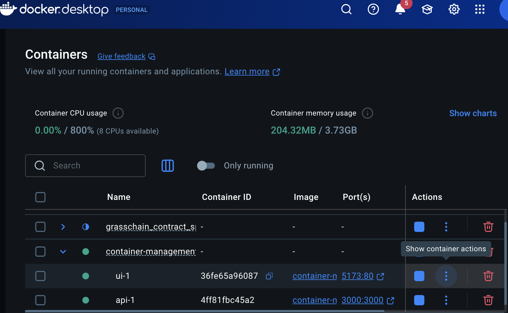
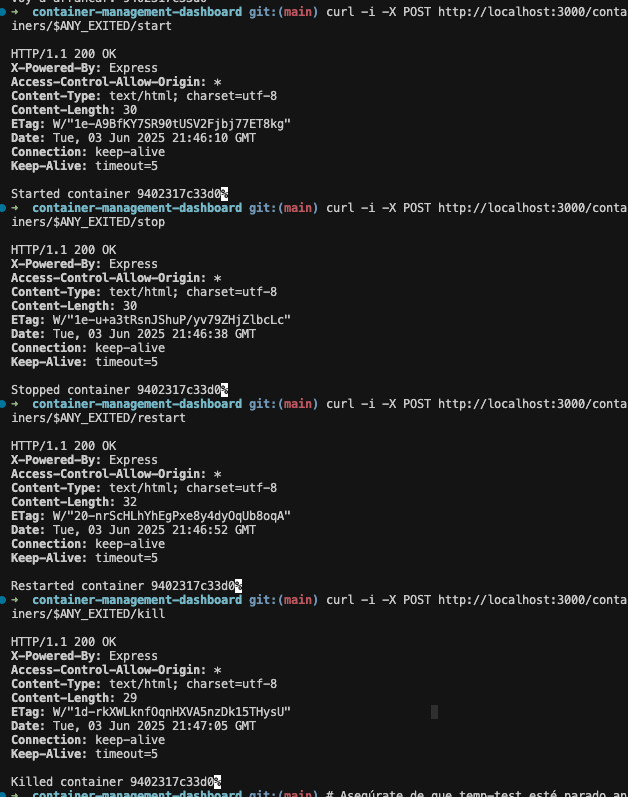

# Container Management Dashboard

¡Hola! Soy Nicolás y este es mi proyecto de prueba técnica para Dappnode. Aquí encontrarás dos servicios orquestados con Docker Compose que te permiten gestionar cualquier contenedor en tu máquina host.

- **API**: servidor Express en TypeScript que expone endpoints REST para listar, arrancar, parar, reiniciar y matar contenedores usando el socket de Docker.
- **UI**: app React (Vite + Tailwind CSS) que consume la API y muestra un panel con estadísticas y lista de contenedores con botones de acción.

---

## 1. Estructura resumida de carpetas:
Divididiendo el root en dos secciones una para api y otra para ui. Un ultimo documento docker-compose.yml para el manejo y definicion de los networks y servicios utilizados.
```bash
container-management-dashboard/
├── api/
│ ├── src/index.ts # Lógica de endpoints Express en TS
│ ├── package.json
│ ├── tsconfig.json
│ ├── Dockerfile # Multi-stage: builder + producción con docker.io
│ └── tests/test-endpoints.sh# Script de pruebas básicas con curl + jq
│
├── ui/
│ ├── public/index.html # Plantilla HTML para Vite
│ ├── src/
│ │ ├── main.tsx # Renderiza <App /> en #root
│ │ ├── App.tsx # Proveedores (React Query, React Router, Toast)
│ │ ├── pages/Index.tsx # Pantalla principal (fetch, estadísticas, lista)
│ │ ├── components/
│ │ │ └── ContainerCard.tsx # Tarjeta de contenedor con botones
│ │ └── hooks/use-toast.ts # Hook para mostrar toasts
│ ├── package.json
│ ├── tsconfig.json
│ ├── vite.config.ts
│ ├── tailwind.config.cjs
│ ├── postcss.config.cjs
│ ├── Dockerfile # Multi-stage: builder + nginx:alpine
│ ├── nginx.conf # Config básica de Nginx
│ └── .env.example # VITE_API_URL=http://api:3000
│
├── docker-compose.yml # Orquesta api y ui en red "dappnet"
├── .gitignore # Ignorar dist, node_modules, .env.local, etc.
└── README.md # Este documento
```

Y las imagenes cap1 y cap2.

---

## 2. Requisitos previos

- **Docker** (v20.10+) instalado y el demonio corriendo.  
- **Docker Compose** (v1.25+ o plugin `docker compose`).  
- (Opcional para desarrollo local) **Node.js** (v16+) y **npm** (v8+).  
- (Opcional) **jq** para parsear JSON en scripts de prueba.

---

## 3. Cómo construir y ejecutar

1. Clona el repositorio:
   ```bash
   git clone https://github.com/nicoland00/container-management-dashboard.git
   cd container-management-dashboard

2. Copia el archivo de ejemplo de variables en ui/:
cd ui
cp .env.example .env.local
cd ..

3. Levanta los servicios con Docker Compose:
docker compose up --build -d

4. Verifica el estado:
docker compose ps

Con este comando deberias de ver dos sercicios activos api y ui. 

5. Accede a el servicio ui desde: http://localhost:5173 

## 4. Docker Compose (dappnet)

Codigo del archive docker-compose.yml:

networks:
  dappnet:
    driver: bridge

services:
  api:
    build: ./api
    ports:
      - "3000:3000"
    volumes:
      - /var/run/docker.sock:/var/run/docker.sock
    networks:
      - dappnet
    healthcheck:
      test: ["CMD", "curl", "-f", "http://localhost:3000/health"]
      interval: 10s
      timeout: 5s
      retries: 3

  ui:
    build:
      context: ./ui
      args:
        - VITE_API_URL=http://api:3000
    ports:
      - "5173:80"
    networks:
      - dappnet
    depends_on:
      - api

Red dappnet: conecta ambos contenedores en una red interna. La UI, al usar http://api:3000, apunta directamente al contenedor de la API.

API:

Monta /var/run/docker.sock para que Express pueda ejecutar comandos Docker (p.ej. docker ps -a) en el host.

Incluye un healthcheck que lanza un GET /health cada 10 segundos para verificar que el servicio está vivo.

UI:

Recibe como argumento VITE_API_URL=http://api:3000 durante el build, de modo que la aplicación React conoce la URL de la API en el entorno de producción.

Depende de api para asegurarse de que la API esté arriba antes de servir la UI.

> 


## 5. Probando la api (curl)

A continuación algunos ejemplos de peticiones manuales para verificar que la API responde correctamente. En todos ellos, sustituye `<CONTAINER_ID>` por un ID real que obtengas con `docker ps -a` (por ejemplo, un contenedor “exited” de prueba).

---

### Healthcheck

```bash
curl -i http://localhost:3000/health

Resultado esperado:
HTTP/1.1 200 OK
Content-Type: text/plain; charset=utf-8
Content-Length: 2

OK
### Container Actions

To start, stop, restart, or kill a container:

```bash
# Start a container
curl -i -X POST http://localhost:3000/containers/<CONTAINER_ID>/start

# Stop a container
curl -i -X POST http://localhost:3000/containers/<CONTAINER_ID>/stop

# Restart a container
curl -i -X POST http://localhost:3000/containers/<CONTAINER_ID>/restart

# Kill a container
curl -i -X POST http://localhost:3000/containers/<CONTAINER_ID>/kill
```

Expected results will be shown in the dashboard interface:




## 6. Explicación del montaje del socket de Docker

Para que la API pueda controlar contenedores del host (listar, arrancar, detener, etc.), dentro del contenedor de `api` montamos el socket de Docker del host:

```yaml
volumes:
  - /var/run/docker.sock:/var/run/docker.sock
```
Esto significa que, dentro del contenedor api, el binario docker apunta al demonio Docker que corre en tu máquina local.

¡Eso es todo!
Un abrazo Pablo, saludos a todos!
Nicolás.
